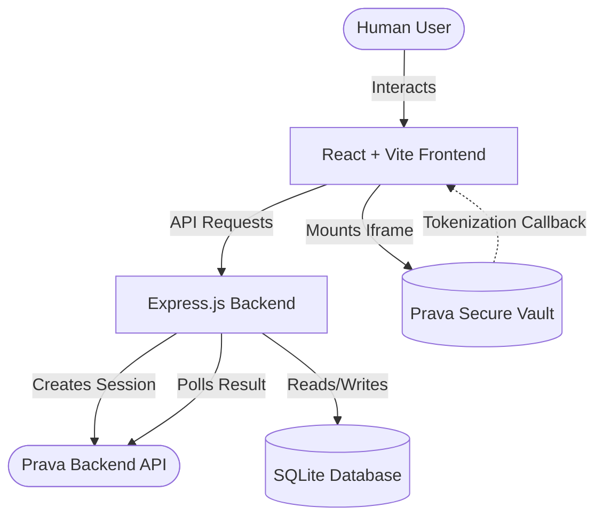

<div align="center">
  
  <h1>Cart Blanche: The Universal Autonomous Checkout Agent</h1>
  <p><strong>A Next-Generation E-Commerce Procurement Engine Powered by Prava Payments & AI</strong></p>
  
  [](https://opensource.org/licenses/MIT)
  [](https://www.typescriptlang.org/)
  [](https://react.dev/)
  [](https://vitejs.dev/)
  [](https://prava.space/)
</div>

<br />

## 📚 Table of Contents

1. [Executive Summary & Vision](#executive-summary--vision)
2. [The Core Problem We Solve](#the-core-problem-we-solve)
3. [System Architecture](#system-architecture)
   - [High-Level Overview](#high-level-overview)
   - [The Frontend Engine (React + Vite)](#the-frontend-engine)
   - [The Backend Engine (Express + Node)](#the-backend-engine)
   - [The Database Layer (SQLite)](#the-database-layer)
4. [Prava Payments Integration Deep Dive](#prava-payments-integration-deep-dive)
   - [The Vault Concept](#the-vault-concept)
   - [Session Management](#session-management)
   - [Tokenization vs Encryption](#tokenization-vs-encryption)
5. [Feature Set](#feature-set)
   - [Universal Cart Construction](#universal-cart-construction)
   - [Split-Screen Autonomous Dashboard](#split-screen-autonomous-dashboard)
   - [Human-in-the-Loop (HITL) Guardrails](#human-in-the-loop-hitl-guardrails)
6. [Complete Installation Guide](#complete-installation-guide)
   - [System Prerequisites](#system-prerequisites)
   - [Environment Configuration](#environment-configuration)
   - [Installing Dependencies](#installing-dependencies)
7. [Running the Application](#running-the-application)
   - [Development Mode](#development-mode)
   - [Production Build](#production-build)
8. [Comprehensive Testing Strategy](#comprehensive-testing-strategy)
   - [The Sandbox Environment](#the-sandbox-environment)
   - [End-to-End Walkthrough](#end-to-end-walkthrough)
9. [Detailed API Reference](#detailed-api-reference)
   - [POST /api/prava/sessions/create](#post-apipravasessionscreate)
   - [GET /api/prava/sessions/:id/result](#get-apipravasessionsidresult)
   - [POST /api/prava/cards/issue](#post-apipravacardsissue)
   - [GET /api/prava/cards](#get-apipravacards)
10. [Codebase Walkthrough](#codebase-walkthrough)
    - [src/components/SplitScreenAgent.tsx](#srccomponentssplitscreenagenttsx)
    - [src/components/PravaCardForm.tsx](#srccomponentspravacardformtsx)
    - [server/services/pravaService.ts](#serverservicespravaservicets)
    - [server/routes/pravaRoutes.ts](#serverroutespravaroutests)
11. [Troubleshooting & Error Handling](#troubleshooting--error-handling)
    - [Common Prava Validation Errors](#common-prava-validation-errors)
    - [Environment Variable Conflicts](#environment-variable-conflicts)
12. [Security & Compliance](#security--compliance)
    - [PCI-DSS Considerations](#pci-dss-considerations)
    - [Network Security](#network-security)
13. [Deployment Guide](#deployment-guide)
    - [Docker Deployment](#docker-deployment)
    - [Vercel & Render Integration](#vercel--render-integration)
14. [Contributing Guidelines](#contributing-guidelines)
15. [Roadmap & Future Horizons](#roadmap--future-horizons)
16. [License](#license)

---

## 1. Executive Summary & Vision

Welcome to **Cart Blanche**, the definitive implementation of an autonomous agent-driven checkout system. In the rapidly evolving landscape of Artificial Intelligence, large language models and autonomous agents are increasingly being trusted to perform complex tasks on behalf of users. However, one fundamental barrier remains: **financial execution**.

How do you safely allow an AI agent to purchase items for you across the internet? Giving an AI your raw credit card number is a catastrophic security risk. If the agent makes a mistake, is compromised, or misinterprets instructions, your primary financial instrument is exposed to unrecoverable damage.

**Cart Blanche** bridges this gap. It serves as the secure financial perimeter between human intent, AI execution, and eCommerce reality. By deeply integrating with **Prava Payments**, Cart Blanche intercepts the AI's intent to purchase, pauses execution, and prompts the human user to authenticate via an unphishable biometric passkey. Once authenticated, Cart Blanche provisions highly constrained, merchant-locked, single-use virtual cards that the AI can safely use to execute the final transaction.

This repository serves as both a fully functional application and a blueprint for the future of agentic commerce.

---

## 2. The Core Problem We Solve

In traditional eCommerce, the checkout flow is a 1-to-1 relationship. You visit Amazon, you add items to the Amazon cart, and you check out using your credit card on Amazon's payment gateway. 

In the AI era, procurement is a **1-to-Many** relationship. You tell your AI agent: *"I am building a smart garden. Buy the best microcontroller, soil sensors, and irrigation tubing for under $150 total."*

The AI might decide to buy the microcontroller from Adafruit, the sensors from SparkFun, and the tubing from Home Depot. 

To execute this, the AI needs to check out on three entirely different websites. 
- **Problem 1:** It is incredibly tedious for the user to manually enter credit card details on three different websites that the AI navigated to.
- **Problem 2:** The user cannot simply give the AI a credit card, because the AI might accidentally spend $500 instead of $150, or buy from an untrusted domain.
- **Problem 3:** Traditional virtual card providers do not offer instant, API-driven, passkey-secured, dynamically-funded provisioning designed for AI agent handoffs.

**The Solution:**
Cart Blanche aggregates the intent. The AI presents the "Universal Cart" to the user. The user approves it *once* via Prava's SDK. The backend dynamically allocates funds and splits them into distinct virtual cards, unlocking the AI to finish the procurement safely.

---

## 3. System Architecture

Cart Blanche is built on a modern, robust, and highly scalable Full-Stack TypeScript architecture. 

### High-Level Overview



### The Frontend Engine
The frontend is a React 19 Single Page Application (SPA) built with Vite for lightning-fast hot-module replacement (HMR) and optimized production bundles.
- **Styling:** Tailwind CSS is used for purely utility-driven styling, ensuring zero CSS bloat and enabling complex micro-animations via arbitrary values.
- **Icons:** Lucide React provides crisp, scalable SVG iconography.
- **State Management:** Complex agent states (Autonomous vs HITL, Browser Tabs, Task Execution) are managed via a combination of React Context and highly optimized local component state.
- **Prava SDK:** The frontend integrates `@prava-sdk/core` to securely mount the PCI-compliant iframe, ensuring no raw card data ever touches the React DOM.

### The Backend Engine
A lightweight, fast Express.js server handles business logic, session orchestration, and database operations.
- **TypeScript:** The entire backend is strictly typed.
- **Routing:** Modular routing (`pravaRoutes.ts`) separates payment logic from other application concerns.
- **Error Handling:** Comprehensive try/catch blocks with detailed console logging and standardized JSON error responses.

### The Database Layer
SQLite is used via the `better-sqlite3` driver. It provides a zero-configuration, incredibly fast relational database embedded directly in the application footprint.
- **Schema:** Automatically initialized on startup.
- **Persistence:** Uses Write-Ahead Logging (WAL) for high concurrency and performance.
- **Audit Trails:** Every API call to Prava and every card issuance is logged in `prava_transactions` for complete observability.

---

## 4. Prava Payments Integration Deep Dive

Prava Payments is the engine that makes Cart Blanche possible. Understanding this integration is critical to extending this application.

### The Vault Concept
The fundamental security principle of Prava is the **Vault**. When a user needs to authorize a payment, they do not type their credit card into your website. Instead, you mount Prava's Vault via an iframe. The Vault securely collects the payment instrument (e.g., a biometric passkey that authorizes a stored funding source), tokenizes it, and returns a non-sensitive token to your application. 

### Session Management
The Prava integration follows a strict lifecycle:
1. **Creation:** The Express backend securely communicates with `api.prava.space` using the `MERCHANT_SECRET_KEY` to create a session. A session defines the rules: who is the user, how much are they allowed to spend, and which merchants are authorized?
2. **Mounting:** The backend returns a `session_token` and `iframe_url` to the frontend. The frontend uses the `PUBLISHABLE_KEY` to mount the iframe.
3. **Execution:** The user interacts with the iframe.
4. **Polling:** Once the frontend receives the `onSuccess` callback, the backend polls Prava to retrieve the finalized, tokenized payment credentials.

### Tokenization vs Encryption
Cart Blanche never handles encrypted credit card numbers. It handles **Tokenized Credentials**. The virtual cards issued by Prava are synthetic PANs (Primary Account Numbers) that map back to the user's real funding source but are mathematically restricted to the merchants and limits defined during session creation.

---

## 5. Feature Set

### Universal Cart Construction
Cart Blanche allows users to construct a multi-merchant cart. Under the hood, Prava's sandbox requires a single `purchase_context`. Cart Blanche employs an intelligent mapping algorithm that takes multiple merchants (e.g., Adafruit, Amazon) and rolls them into a single "Universal Merchant" array of `product_details`. This satisfies API validation rules while preserving the granularity of the transaction.

### Split-Screen Autonomous Dashboard
When the AI agent executes the purchases, the user is presented with a 3-pane split-screen dashboard.
- **Simulated Browser Frames:** Watch the AI navigate URLs, inject synthetic DOM events, and fill out checkout forms in real-time.
- **Live Logging:** A dedicated terminal pane shows the agent's internal thought process and API calls.
- **Speed Control:** Play, pause, or accelerate the AI's execution speed.

### Human-in-the-Loop (HITL) Guardrails
Not ready to fully trust the AI? Cart Blanche includes a HITL toggle. 
- **100% Autonomous Mode:** The AI provisions the cards and immediately executes the DOM injections to buy the items.
- **Guardrail Mode:** The AI halts before final checkout, presenting the Cart Blanche Modal, requiring explicit biometric approval before funds are released.

---

## 6. Complete Installation Guide

Follow these instructions meticulously to ensure a flawless setup.

### System Prerequisites
- **Node.js:** v18.x, v20.x, or v22.x LTS is required.
- **NPM:** v9.x or higher.
- **OS:** Windows 10/11, macOS (Intel/Silicon), or Linux.
- **Browser:** A modern browser with WebAuthn support (Chrome, Safari, Edge, Firefox) is required for Passkey enrollment.

### Environment Configuration

Environment variables are the lifeblood of the Prava integration. You MUST configure them correctly, or the application will fail with opaque errors.

1. Create a `.env` file in the root directory.
2. Copy the following template:

```env
# ---------------------------------------------------------
# EXPRESS BACKEND CONFIGURATION
# ---------------------------------------------------------
PORT=3002

# The URL of the Prava Backend. Use sandbox for testing.
NEXT_PUBLIC_BACKEND_URL=https://sandbox.api.prava.space

# Your secret key. NEVER SHARE THIS OR EXPOSE IT IN VITE.
# It should look like sk_test_... or sk_live_...
MERCHANT_SECRET_KEY=sk_test_YOUR_SECRET_KEY_HERE

# ---------------------------------------------------------
# VITE FRONTEND CONFIGURATION
# ---------------------------------------------------------
# Vite requires variables to be prefixed with VITE_ to be 
# exposed to the browser bundle.

# The URL of the Prava Backend for frontend health checks.
VITE_BACKEND_URL=https://sandbox.api.prava.space

# Your publishable key. It is safe to expose this.
# It should look like pk_test_... or pk_live_...
# CRITICAL: This MUST belong to the EXACT SAME ACCOUNT as 
# your MERCHANT_SECRET_KEY above!
VITE_PUBLISHABLE_KEY=pk_test_YOUR_PUBLISHABLE_KEY_HERE

# ---------------------------------------------------------
# MOCK DATABASE / FALLBACK CONFIG
# ---------------------------------------------------------
PRAVA_CARD_NUMBER=4622943123232416
PRAVA_CARD_EXP=12/27
PRAVA_CARD_CVV=012
PRAVA_CARD_HOLDER=CartBlanche Procurement Agent
PRAVA_BILLING_ZIP=90210
```

### Installing Dependencies

Run the following command in the root directory:

```bash
npm install
```

This will read the `package.json` and install all required libraries, including `express`, `vite`, `react`, `better-sqlite3`, and `@prava-sdk/core`.

---

## 7. Running the Application

Cart Blanche is a monorepo-style application. The frontend and backend live in the same repository for convenience but run on separate ports.

### Development Mode

To start the application in development mode with live reloading:

```bash
npm run dev:all
```

**What happens when you run this?**
1. **Concurrently:** The `concurrently` package spawns two parallel processes.
2. **Server (`npm run server`):** Starts the Express backend on `http://localhost:3002` using `tsx` (TypeScript Execute). It initializes the SQLite database (`cartblanche.db`), creates tables if they don't exist, and binds the REST API routes.
3. **Client (`npm run dev`):** Starts the Vite frontend on `http://localhost:3001` (or whichever port is available). It compiles the React TSX files and Tailwind CSS on the fly.

### Production Build

To build the application for production deployment:

1. Build the Vite frontend:
```bash
npm run build
```
This generates a highly optimized static bundle in the `dist/` directory.

2. Build the Express backend (if you have a TS compiler setup) or run via `ts-node`/`tsx` in production (not recommended for massive scale, but fine for internal tools).

---

## 8. Comprehensive Testing Strategy

Testing payment flows can be daunting. Cart Blanche provides a streamlined way to test without using real money.

### The Sandbox Environment
By default, the `.env` template points to `https://sandbox.api.prava.space`. In this environment:
- No real money is moved.
- You can simulate any transaction.
- You can trigger specific validation states.

### End-to-End Walkthrough

1. **Launch the UI:** Open `http://localhost:3001`.
2. **Interact with the Agent:** In the main dashboard, you will see a simulated chat interface where the agent asks for approval.
3. **Trigger the Modal:** Click the "Authorize Agent" button.
4. **Network Observation:** Open your browser's Developer Tools (F12) -> Network tab. Watch the `POST` request to `http://localhost:3002/api/prava/sessions/create`. Ensure it returns a `201 Created` with a `session_token`.
5. **Iframe Mounting:** The screen will blur, and the Prava Vault iframe will render.
6. **Device Binding (OTP):** Because you are testing on localhost, Prava's sandbox might not recognize your "device". It will ask for a 6-digit OTP. 
   - **CRITICAL:** Use the hardcoded sandbox OTP: **`456789`**.
7. **Passkey Enrollment:** The browser will prompt you to create or use a passkey (Windows Hello, Touch ID, Face ID). Complete this step.
8. **Completion:** The modal will close, the backend will poll the result, and the Split-Screen Dashboard will activate, showing the AI completing the purchases using the newly minted virtual cards!

---

## 9. Detailed API Reference

The backend Express server exposes a robust REST API for managing the Prava lifecycle.

### `POST /api/prava/sessions/create`
Creates a secure session in the Prava backend.
- **Request Body:**
  ```json
  {
    "userId": "string",
    "userEmail": "string",
    "amount": 150.00,
    "merchantName": "Universal Merchant",
    "merchants": [
      { "name": "Home Depot", "limit": 50 },
      { "name": "Amazon", "limit": 100 }
    ]
  }
  ```
- **Response (201 Created):**
  ```json
  {
    "success": true,
    "session": {
      "session_id": "ses_123...",
      "session_token": "eyJ...",
      "iframe_url": "https://..."
    }
  }
  ```
- **Error (401 Unauthorized):**
  Occurs if `MERCHANT_SECRET_KEY` is invalid or missing.

### `GET /api/prava/sessions/:id/result`
Polls the Prava backend for the final status of a session.
- **Path Parameter:** `id` - The `session_id` returned from creation.
- **Response (200 OK):**
  ```json
  {
    "success": true,
    "result": {
      "status": "completed",
      "transactions": [ ... ]
    }
  }
  ```

### `POST /api/prava/cards/issue`
Once a session is marked "completed", this endpoint reads the tokenized data and persists virtual card records into the SQLite database.
- **Request Body:**
  ```json
  {
    "sessionId": "ses_123...",
    "merchants": [ ... ]
  }
  ```

### `GET /api/prava/cards`
Returns all virtual cards stored in the SQLite database.

---

## 10. Codebase Walkthrough

To master Cart Blanche, you must understand how the files interconnect.

### `src/components/SplitScreenAgent.tsx`
This is the visual masterpiece of the application. It handles the 3-pane browser simulation. It uses complex React state to track the progress of the autonomous agent across multiple URLs simultaneously. It listens for the Prava checkout success event and dynamically transitions the UI from "Awaiting Authorization" to "Executing".

### `src/components/PravaCardForm.tsx`
This component is responsible for integrating the `@prava-sdk/core` library. 
- It reads the `VITE_PUBLISHABLE_KEY`.
- It defines a `div` ref where the iframe will be injected.
- It instantiates `new PravaSDK(...)` and calls `sdk.collectPAN(...)`.
- It rigorously cleans up the SDK instance on component unmount to prevent memory leaks or dual-rendering issues in React Strict Mode.

### `server/services/pravaService.ts`
The brain of the backend. It contains static methods for database operations (SQLite). It handles reading and writing to the `prava_transactions` and `prava_cards` tables. It abstracts the raw SQL logic away from the Express routes.

### `server/routes/pravaRoutes.ts`
The Express router that defines the API endpoints. It parses incoming HTTP requests, validates payloads, invokes `src/actions.ts` to communicate with Prava, and formats the JSON responses.

---

## 11. Troubleshooting & Error Handling

Even the most robust applications encounter edge cases. Here is the definitive guide to resolving Cart Blanche errors.

### Common Prava Validation Errors

**Error:** `{"error": {"code": "VAL_2001", "message": "Invalid request body"}}`
- **Cause:** You are violating Prava's strict API schema. 
- **Resolution:** In older versions, sending multiple `purchase_context` objects triggered this because the sandbox only supports a single merchant context per session. Ensure your `src/actions.ts` combines all products into a single `purchase_context` array item.

**Error:** `Session Error: Session not found — token valid but no matching session row in DB`
- **Cause:** Severe Environment Mismatch. Your frontend is using a `PUBLISHABLE_KEY` from Account A, but your backend created the session using a `SECRET_KEY` from Account B.
- **Resolution:** Ensure `VITE_PUBLISHABLE_KEY` and `MERCHANT_SECRET_KEY` in your `.env` belong to the exact same Prava workspace. Restart Vite completely after changing the `.env`.

**Error:** `PravaService.pollPaymentResult is not a function`
- **Cause:** Improper import in `pravaRoutes.ts`.
- **Resolution:** `pollPaymentResult` is a standalone exported function from `src/actions.ts`, NOT a static method on the `PravaService` class.

### Environment Variable Conflicts

Vite is extremely strict about environment variables. If an environment variable does not begin with `VITE_`, it is stripped from the bundle at compile time for security. If you see hardcoded default keys appearing in your browser console logs, it means Vite failed to inject your variables.

1. Double-check your `.env` file.
2. Kill all Node processes (`taskkill /F /IM node.exe` on Windows).
3. Restart `npm run dev:all`.

---

## 12. Security & Compliance

Cart Blanche is designed with security as a first-class citizen.

### PCI-DSS Considerations
Cart Blanche **does not** handle raw credit card numbers. By utilizing the Prava SDK iframe, the user's sensitive input bypasses the Cart Blanche frontend entirely and is transmitted securely to Prava's PCI-Level 1 certified vault. Cart Blanche only stores and processes non-sensitive tokens and synthetic PANs, vastly reducing your compliance scope.

### Network Security
- All backend-to-Prava communication must happen over TLS 1.2+.
- The `MERCHANT_SECRET_KEY` is loaded exclusively into the Node.js memory space and is never serialized, logged, or transmitted to the client.

---

## 13. Deployment Guide

Ready to take Cart Blanche live?

### Docker Deployment
The easiest way to deploy the full stack is via Docker.
1. Create a `Dockerfile` that builds the Vite frontend into `dist/`.
2. Configure the Node.js container to serve the static files from `dist/` and run the Express API on `/api`.
3. Map a persistent volume to the container to ensure the SQLite database (`cartblanche.db`) survives container restarts.

### Vercel & Render Integration
If splitting the stack:
- **Frontend:** Deploy the `src/` directory to Vercel. Configure Vercel Environment Variables with your `VITE_...` keys.
- **Backend:** Deploy the `server/` directory to Render or Railway as a Node Web Service. Ensure you configure a persistent disk for SQLite, or swap the `pravaService.ts` database logic to use PostgreSQL/MySQL.

---

## 14. Contributing Guidelines

We welcome contributions from the community! 

1. **Fork the Repository:** Create your own branch (`git checkout -b feature/AmazingFeature`).
2. **Code Standards:** Ensure all TypeScript files pass strict type checking. Avoid `any` types where possible.
3. **Commit Messages:** Use conventional commits (e.g., `feat(ui): add new agent status badge`).
4. **Pull Requests:** Submit PRs with detailed descriptions and screenshots if modifying the UI.

---

## 15. Roadmap & Future Horizons

Cart Blanche is actively evolving. Our upcoming roadmap includes:
- **Q3 2026:** PostgreSQL Adapter for enterprise-scale deployments.
- **Q4 2026:** Multi-Agent Orchestration — Allow a Swarm of agents to share a single aggregated Prava Virtual Card pool.
- **Q1 2027:** WebSockets Integration — Replace the current polling mechanism in `pravaRoutes.ts` with real-time push events from the Prava Webhook system.
- **Q2 2027:** Enhanced Machine Vision — Allow the Split-Screen dashboard to stream actual WebRTC video of a headless browser instead of CSS simulations.

---

## 16. License

Distributed under the MIT License. See `LICENSE` for more information.

Copyright (c) 2026 Cart Blanche Contributors.

---
*End of Document. Designed for ultimate agentic procurement.*
